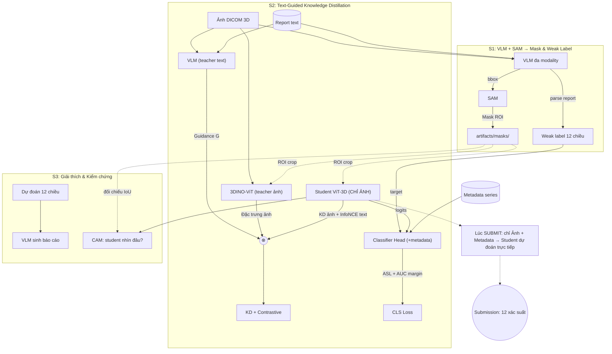

# Kiến trúc — RSNA Knee Abnormality Detection

> Khôi phục và cập nhật từ `pipeline_version_1.md` sau đợt refactor.
> Tên module trong tài liệu này trỏ tới cây `src/knee_mri/` hiện hành.

## Thông tin then chốt từ dataset

- **Huấn luyện:** có cả ẢNH (DICOM series) và TEXT (radiology report, đa ngôn ngữ).
  Cả **4407** study đều có `Report`; chỉ **58** có nhãn cấu trúc 12 cột.
  (Hai con số này được xác minh lại bằng `StudyCatalog.from_csv` — xem log khi chạy.)
- **Inference / Submit:** chỉ có ẢNH. Không có report. Model phải "hiểu" report
  lúc huấn luyện để lúc test chỉ cần ảnh.
- **Metadata series** (`Anatomical_Plane`, `Fluid_Sensitive`, `Fat_Suppression`)
  có mặt ở **cả** `test_series.csv` → dùng được làm đầu vào phụ trợ lúc inference.
- **Đầu ra:** 12 xác suất (multi-label) mỗi study, đúng định dạng `sample_submission.csv`.

Phân bố ngôn ngữ của report (ước lượng bằng từ khóa đặc trưng):

| Ngôn ngữ | Số study (ước lượng) |
|---|---|
| Anh | ~1591 |
| Tây Ban Nha | ~701 |
| Hà Lan | ~303 |
| Đức | ~244 |
| Pháp | ~80 |
| Không xác định | ~1488 |

Đây là lý do `knee_mri.labeling.keywords` phải xử lý phủ định đa ngôn ngữ.

## Ý tưởng cốt lõi

Dùng **knowledge distillation có hướng dẫn bởi text**:

- Một **teacher đa modality** (VLM) đọc (ảnh + report) sinh ra vector **guidance G**
  chứa tri thức lâm sàng từ report.
- Một **teacher ảnh** (3DINO-ViT, ViT-Large 3D) sinh đặc trưng ảnh mạnh.
- **Student** là **ViT-3D chỉ dùng ảnh**, được huấn luyện để bắt chước cả hai
  teacher. Nhờ vậy lúc inference (không có text) student đã hấp thụ tri thức
  report qua KD và vẫn dự đoán tốt từ ảnh + metadata.

## Sơ đồ



## Chi tiết từng bước

### S1 — Mask ROI và weak label

| Việc | Module | Đầu ra |
|---|---|---|
| VLM sinh bbox, SAM tinh chỉnh thành mask | `models/sam_masker.py`, `pipeline/masks.py` | `artifacts/masks/<study>/<series>.npy` |
| Parse report thành 12 nhãn | `labeling/`, `pipeline/weak_labels.py` | `artifacts/weak_labels/<study>.json` |

Weak label có hai đường: luật từ khóa đa ngôn ngữ (`labeling/rule_based.py`, chạy
trên CPU) và VLM (`labeling/llm_based.py`, cần GPU). Cả hai đều là bước
**precompute offline** — không bao giờ gọi trong `Dataset.__getitem__`.

### S2 — Text-guided KD

- **Teacher ảnh:** 3DINO-ViT encode volume 3D → vector 1024 chiều
  (`models/teachers/dino3d.py`), cache tại `artifacts/teacher_feats/`.
- **Teacher text:** VLM đa modality encode (lát cắt giữa + report) → guidance `G`
  (`models/teachers/gemma_guidance.py`), cache tại `artifacts/guidance/`.
- **Student:** ViT-3D nhận volume đã ROI-crop, xuất đặc trưng CLS
  (`models/student/vit3d.py`).
- **Loss** (`training/losses.py`):

  ```
  L = λ_kd  · cosine(proj_img(feat), 3DINO)
    + λ_ctr · InfoNCE(img_embed, text_embed)
    + λ_cls · AsymmetricLoss(logits, weak_label)
    + λ_auc · AUCMargin(logits, weak_label)
  ```

- Student **không bao giờ** thấy text lúc forward; text chỉ tạo mục tiêu KD.

### S3 — CAM và báo cáo

- CAM bằng attention rollout của student (`explain/cam.py`).
- Đối chiếu CAM với mask S1 bằng IoU/Dice (`explain/overlay.py`) để kiểm chứng
  student "nhìn" đúng vùng giải phẫu.
- VLM sinh báo cáo bằng lời từ vector xác suất (`models/report_generator.py`),
  có fallback rule-based nên bước này luôn cho ra sản phẩm.

## Inference (submit)

Chỉ dùng ảnh + metadata series (`test_series.csv`):

```
student(volume) → classifier(feat, metadata) → sigmoid → 12 xác suất
```

Trung bình trên các series của cùng study. Không cần report, không cần teacher.
Cài đặt tại `inference/predictor.py`.

## Ghi chú quan trọng

- **License 3DINO-ViT:** CC BY-NC-ND — chỉ nghiên cứu phi thương mại, clone
  nguyên gốc vào `vendor/3DINO` và **không sửa** code trong đó.
- **Nhãn cực thưa** (~1–2% dương tính mỗi nhãn) → ưu tiên AUC; dùng Asymmetric
  Loss thay cho BCE thường.
- **58 study có nhãn gold** được giữ làm **validation cố định** (`data/splits.py`).
  Quá ít để huấn luyện, nhưng là tín hiệu duy nhất về metric thật.
- **Model ID của VLM** khai báo tại `configs/base.yaml` (`vlm.model_id`) — đây là
  nguồn sự thật duy nhất. Xác minh model tồn tại trên HF Hub trước khi chạy dài.
- **Bất biến shape:** mọi volume có shape `cfg.data.target_shape`. Xem
  `docs/refactor_guide.md` §6.3 để biết vì sao đây là điều kiện sống còn.
